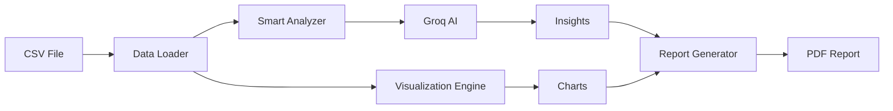

# 🔥 Data Insight Copilot

<div align="center">
  
  
  
  
</div>

## 📊 Descripción

**Data Insight Copilot** es un asistente inteligente que analiza archivos CSV automáticamente, detecta patrones, genera visualizaciones y crea reportes profesionales usando IA.

### ✨ Características principales

- 🧠 **Análisis con IA**: Usa Groq AI para generar insights en lenguaje natural
- 📈 **Visualizaciones automáticas**: Genera gráficos relevantes sin configuración
- 🎯 **Detección de anomalías**: Identifica outliers con múltiples algoritmos
- 📄 **Reportes PDF**: Genera reportes profesionales con un click
- 🚀 **Interfaz intuitiva**: Diseño moderno y fácil de usar

<!-- ## 🎬 Demo


[Ver video completo en YouTube](#) -->

## 🛠️ Instalación

### Requisitos previos
- Python 3.8 o superior
- Cuenta gratuita en [Groq](https://console.groq.com)

### Pasos de instalación

1. **Clonar el repositorio**
```bash
git clone https://github.com/joaquin-papagianacopoulos/data-insight-copilot.git
cd data-insight-copilot
```

2. **Crear entorno virtual**
```bash
python -m venv venv
source venv/bin/activate  # En Windows: venv\Scripts\activate
```

3. **Instalar dependencias**
```bash
pip install -r requirements.txt
```

4. **Configurar API Key**
```bash
cp .env.example .env
# Editar .env y agregar tu GROQ_API_KEY
```

5. **Ejecutar la aplicación**
```bash
streamlit run app.py
```

## 📝 Uso

1. **Cargar datos**: Arrastrá tu archivo CSV en la barra lateral
2. **Analizar**: Hacé click en "🚀 Analizar con IA"
3. **Explorar**: Navegá por las pestañas para ver insights y visualizaciones
4. **Exportar**: Descargá el reporte en PDF

### Ejemplo de análisis

```python
# El sistema detecta automáticamente:
- Tipos de datos y calidad
- Patrones y tendencias
- Correlaciones entre variables
- Valores atípicos
- Recomendaciones accionables
```

## 🏗️ Arquitectura

```
data-insight-copilot/
├── app.py                    # Aplicación principal Streamlit
├── smart_analyzer.py         # Motor de análisis con IA
├── visualization_engine.py   # Generador de visualizaciones
├── report_generator.py       # Generador de reportes PDF
├── config.py                # Configuración de modelos
├── requirements.txt         # Dependencias
├── .env.example            # Template de variables de entorno
└── README.md              # Este archivo
```

### Flujo de datos



## 🤖 Tecnologías utilizadas

- **Frontend**: Streamlit
- **IA**: Groq (Llama 3.1)
- **Visualización**: Plotly, Matplotlib, Seaborn
- **Análisis**: Pandas, NumPy, SciPy, Scikit-learn
- **Reportes**: ReportLab
- **LLM Framework**: LangChain

## 📊 Tipos de análisis

### 1. Análisis de calidad
- Detección de valores faltantes
- Identificación de tipos de datos incorrectos
- Evaluación de consistencia

### 2. Análisis estadístico
- Estadísticas descriptivas
- Distribuciones
- Correlaciones

### 3. Detección de anomalías
- IQR (Interquartile Range)
- Z-Score
- Isolation Forest

### 4. Visualizaciones
- Histogramas y distribuciones
- Matriz de correlación
- Box plots y violin plots
- Series temporales
- Análisis categórico

## 🚀 Roadmap

- [x] MVP con análisis básico
- [x] Visualizaciones automáticas
- [x] Detección de anomalías
- [x] Generación de PDF
- [ ] Soporte para múltiples idiomas
- [ ] Análisis predictivo
- [ ] Integración con bases de datos
- [ ] API REST

## 🤝 Contribuir

Las contribuciones son bienvenidas! Por favor:

1. Fork el proyecto
2. Crea tu feature branch (`git checkout -b feature/AmazingFeature`)
3. Commit tus cambios (`git commit -m 'Add some AmazingFeature'`)
4. Push a la branch (`git push origin feature/AmazingFeature`)
5. Abrí un Pull Request

## 📄 Licencia

Distribuido bajo la licencia MIT. Ver `LICENSE` para más información.

## 👥 Autor

**Tu Nombre**
- LinkedIn: [Joaquin Papagianacopoulos](https://linkedin.com/in/joaquinpapagianacopoulos)
- GitHub: [@joaquin-papagianacopoulos](https://github.com/joaquin-papagianacopoulos)
- Email: joaquinpapagianacopoulos@gmail.com

## 🙏 Agradecimientos

- [Groq](https://groq.com) por proporcionar acceso gratuito a su API
- [Streamlit](https://streamlit.io) por el framework
- [Plotly](https://plotly.com) por las visualizaciones interactivas

---

<div align="center">
  Hecho con ❤️ y ☕ por Joaquin
</div>